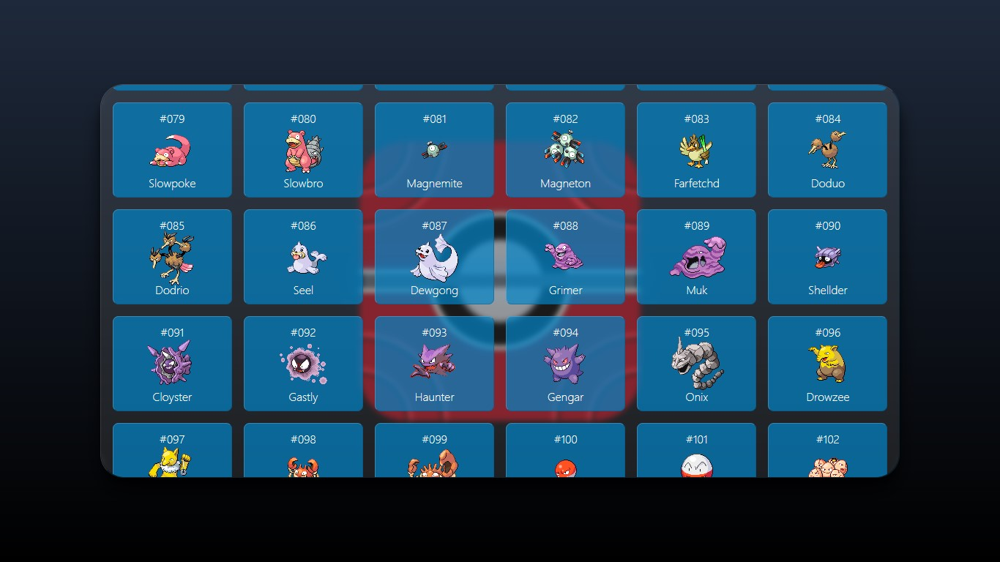

# Ultimate Pokedex

<div align="center">
    
    
</div>


Os dois projetos mais batidos que todo estudante de front-end faz são o da calculadora e o da Pokedex. Como já fiz o da calculadora, agora é a hora da minha pokedex.

Como uma grande parte dos projetos usam a PokeAPI apenas pra fazer a requisição e exibir as imagens com os nomes dos respectivos pokemon, então, vou incrementar esse também assim como fiz com a calculadora ([link do o repositório do projeto](https://github.com/hennanlewis/calculadora-diferenciada), o README.md tá massa).

<br>

## Pontos a serem contemplados

### Basicamente pretendo atingir alguns pontos em relação ao desenvolvimento:
- [x] utilizar princípios de Clean Code ( ou pelo menos tanto quanto eu conseguir )
- [ ] utilizar sistema de rotas pra navegar entre as principais funções
- [x] utilizar **glassmorphism*** como padrão de design
- [x] utilizar a PokeAPI pra obter os dados
- [x] utilizar React com TypeScript
- [x] aplicação responsível
- [ ] utilizar **GraphQL****

\* tendência de design que o objetivo é "imitar" visual do vidro.
** ainda em processo de análise, pois a resposta da API nos trás muitos dados que não nos interessa.

<br>

### Agora em relação às funções pretendidas, são as seguintes:
- [x] exibir Pokedex Nacional (todos os pokemon e seus respectivos nomes)
- [ ] cálculo de porcentagem de taxa de sucesso de captura de cada um
- [ ] comparar tamanho do pokemon com o tamanho do Ash
- [x] exibir dados sobre cada pokemon individualmente
- [ ] exibir valores de status base em gráfico de radar
- [ ] botão para executar som de cada pokemon
- [ ] exibir pokemon por geração dos jogos
- [ ] quiz "quem é esse pokemon?"
- [ ] quiz dos sons de pokemon
- [ ] filtros de pesquisa
- [ ] lista de golpes

<br>

## Mas são muitas funções propostas...
Sim, tenho consciência disso! Porém, também tenho confiança no meu interesse e nas minhas habilidades, pois já tenho um pouco de costume em fazer projetos, mas nunca os coloquei no Github por serem coisas bem triviais feitas para conhecer a tecnologia.

<br>

## Como executar o projeto

1. Após clonar o repositório, o seguinte código instala as dependências necessárias:

```shell
yarn
```

Caso tenha preferência pelo `npm` como gerenciador de pacotes, utilize:

```shell
npm install
```

2. Após a finalização da instalação das dependências necessárias, o seguinte código executa a aplicação:

```shell
yarn start
```

ou caso tenha preferência pelo `npm` como gerenciador de pacotes:

```shell
npm start
```

- Caso a aplicação não abra automaticamente no navegador, abra [http://localhost:3000](http://localhost:3000) no navegador.

3. Para parar a aplicação, pressione `ctrl+c` no teclado.